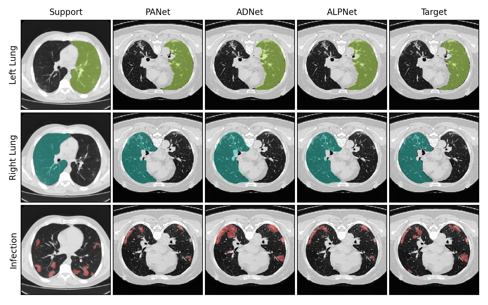

# COVID-19 Few-Shot Segmentation

Few-shot learning has gained ample momentum in the past few years, thanks to its adaptability to small labeled datasets. This is especially relevant in medical imaging, where datasets often have limited high-quality annotations, like in CT scans of COVID-19 infection.

This project aims to provide an intuitive framework, with detailed documentation and easily usable code, to show the benefits of using few-shot learning for semantic segmentation of COVID-19 lungs infection. Also, by the very nature of few-shot learning, the framework is readily applicable to automatic detection/segmentation of other types of lung infection without need for re-training on more specific datasets.

The few-shot models used in this project are based on [PANet](https://github.com/kaixin96/PANet), [ADNet](https://github.com/sha168/ADNet) and [ALPNet](https://github.com/cheng-01037/Self-supervised-Fewshot-Medical-Image-Segmentation), which are popular in the medical image segmentation landscape. Have a look at their papers!

Thanks for your interest. 🙂




## Getting Started

1. Clone/fork the repository.

2. Install the required dependencies, listed in `requirements.txt`

3. Change the paths in the script files `./experiments/<...>.sh` according to your root directory.

### Data Preparation

1. Download the [COVID-19-CT-Seg](https://zenodo.org/record/3757476) dataset.

2. Put the CT scans under `./data/COVID-19-CT-Seg/Data` and the segmentation masks under `./data/COVID-19-CT-Seg/<Infection_Mask/Lung_Mask/Lung_and_Infection_Mask>`

3. Run the data pre-processing [notebook](data_preprocessing.ipynb) [](https://colab.research.google.com/github/fbono97/few-shot-covid19-seg/blob/master/data_preprocessing.ipynb)

☝ *This pre-processing pipeline can be used for other medical imaging datasets with minor adjustments, feel free to experiment!*


## Basic Usage

- Adjust the experimental settings in `./configs/config_<panet/adnet/alpnet>.yaml`

- Each model is trained and evaluated in a five-fold cross-validation fashion. For each fold:

    1. Train on training split by running `./experiments/train_<panet/adnet/alpnet>.sh`

    2. Evaluate on validation split by running `./experiments/validate_<panet/adnet/alpnet>.sh`

    3. Remember to change `FOLD` in the scripts after each cycle.

☝ *If you have a computer cluster or a machine with multiple GPUs, you can try distributed training. Just change the last command in the train scripts, e.g.*
```
torchrun --nproc_per_node=2  distributed_train.py     # Using 2 GPUs
```
*to run an equivalent training schedule but with distributed settings.*

*Do note that this feature is still under development so it might not work on every machine.*


## Results

- You can use this [noteboook](display_results.ipynb) to visualise the results of your experiments [](https://colab.research.google.com/github/fbono97/few-shot-covid19-seg/blob/master/display_results.ipynb)

- The table below shows a summary of the evaluation scores obtained by training for 50,000 iterations with a ResNet50 backbone.

|       |       | PANet | ADNet | ALPNet  |
|:-----:|:-----:|:-----:|:-----:|:-------:|
|**Left Lung** |  <table><tbody><tr><td>Dice</th></tr><tr><td>Precision</td></tr><tr><td>Recall</td></tr></tbody></table> |  <table><tbody><tr><td>**96.47 ± 0.99**</th></tr><tr><td>97.03 ± 0.82</td></tr><tr><td>95.96 ± 2.18</td></tr></tbody></table> |  <table><tbody><tr><td>92.82 ± 1.00</th></tr><tr><td>88.03 ± 2.12</td></tr><tr><td>98.20 ± 1.12</td></tr></tbody></table>  |  <table><tbody><tr><td>95.42 ± 1.81</th></tr><tr><td>93.56 ± 1.73</td></tr><tr><td>97.41 ± 2.76</td></tr></tbody></table>  |
| **Right Lung** |  <table><tbody><tr><td>Dice</th></tr><tr><td>Precision</td></tr><tr><td>Recall</td></tr></tbody></table> |  <table><tbody><tr><td>**96.92 ± 0.65**</th></tr><tr><td>96.79 ± 0.82</td></tr><tr><td>97.07 ± 1.16</td></tr></tbody></table> |  <table><tbody><tr><td>93.39 ± 0.93</th></tr><tr><td>89.45 ± 1.08</td></tr><tr><td>97.71 ± 1.47</td></tr></tbody></table>  |  <table><tbody><tr><td>95.58 ± 1.84</th></tr><tr><td>92.49 ± 3.52</td></tr><tr><td>98.97 ± 0.77</td></tr></tbody></table>  |
| **Infection** |  <table><tbody><tr><td>Dice</th></tr><tr><td>Precision</td></tr><tr><td>Recall</td></tr></tbody></table> |  <table><tbody><tr><td>47.65 ± 16.36</th></tr><tr><td>45.95 ± 15.41</td></tr><tr><td>73.64 ± 9.41</td></tr></tbody></table> |  <table><tbody><tr><td>34.13 ± 15.08</th></tr><tr><td>27.28 ± 13.74</td></tr><tr><td>84.57 ± 8.14</td></tr></tbody></table>  |  <table><tbody><tr><td>**64.62 ± 14.98**</th></tr><tr><td>61.91 ± 14.58</td></tr><tr><td>77.15 ± 7.17</td></tr></tbody></table>  |

